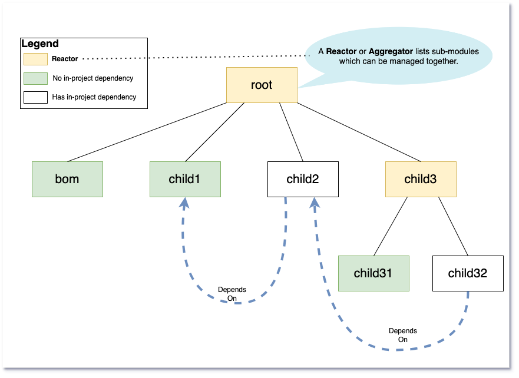

[.text-center]
= Project Structure

:figure-caption!:
:toc:

ifdef::env-github[]
++++

  

++++
endif::[]

ifndef::env-github[]

endif::[]

'''

[caption=" ", .center, cols="<40%, ^20%, >40%", width=95%, grid=none, frame=none]
|===
| &nbsp;
| link:../../README.adoc[README 🔼]
| &nbsp;
|===