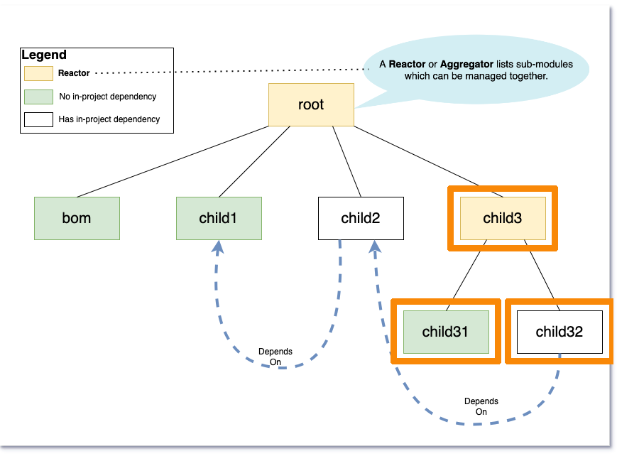

= Demo 1

== Build an aggregator and its child modules

=== Build `child3`, `child31` and `child32`

=== Maven 3

  mvn clean compile -pl child3 -amd
  mvn clean compile -pl child3 --also-make-dependents
  mvn clean compile -pl child3,child3/child31,child3/child32

=== Maven 4
        mvn clean compile -pl child3

'''

[caption=" ", .center, cols="<40%, ^20%, >40%", width=95%, grid=none, frame=none]
|===
| &nbsp;
| link:Demo.adoc[All Demos 🔼]
| link:02_Demo.adoc[Demo 2 ▶️]
|===