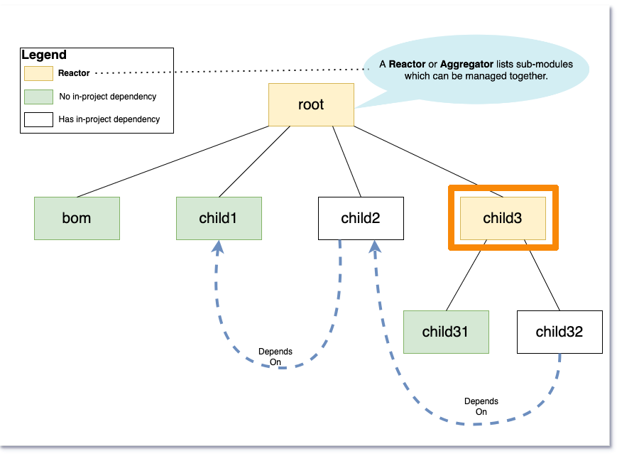

= Change 2

== Build an aggregator and not its child modules

=== Build only `child3`

=== Maven 3

  mvn clean compile -pl child3

=== Maven 4

  mvn clean compile -pl child3 -N

'''

[caption=" ", .center, cols="<40%, ^20%, >40%", width=95%, grid=none, frame=none]
|===
| link:Maven_Change_01.adoc[◀️ Change 1]
| link:OtherChanges.adoc[All Changes 🔼]
| link:Maven_Change_03.adoc[Change 3 ▶️]
|===