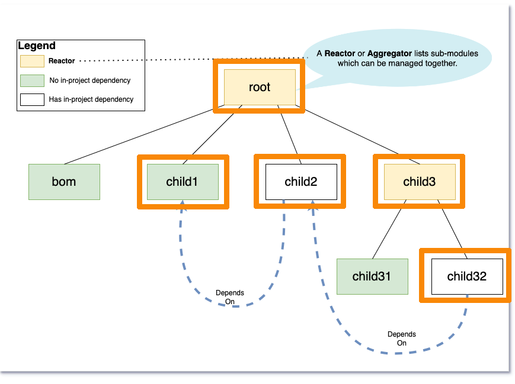

= Change 3

== Build module plus #dependencies# outside of current scope

=== Build `child32`, `child3`, `child2`, `child1`, `root`

=== Maven 3

  NOT POSSIBLE IN MAVEN 3

=== Maven 4

  cd child3/child32 && mvn compile -am

'''

[caption=" ", .center, cols="<40%, ^20%, >40%", width=95%, grid=none, frame=none]
|===
| link:Maven_Change_02.adoc[◀️ Change 2]
| link:OtherChanges.adoc[All Changes 🔼]
| link:Maven_Change_04.adoc[Change 4 ▶️]
|===