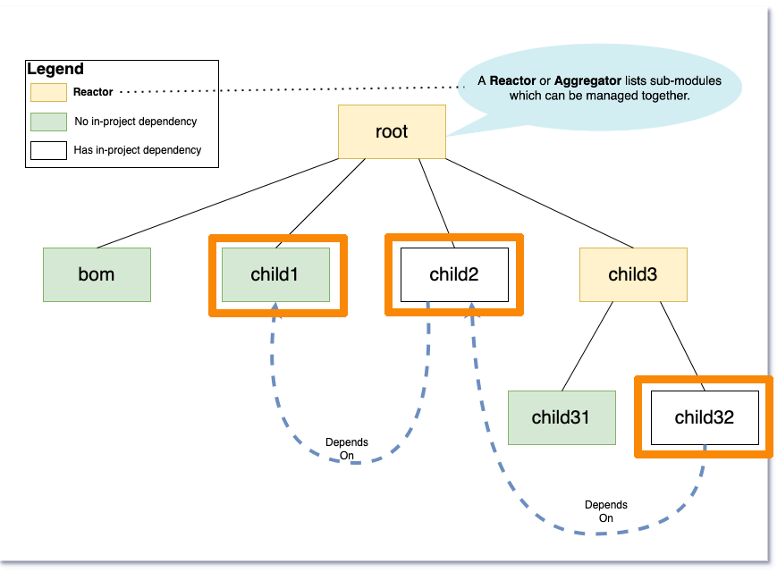

= Change 4

== Build module plus #dependents# outside of current scope

=== Build `child1`, `child2`, `child32`

=== Maven 3

  NOT POSSIBLE IN MAVEN 3

=== Maven 4

  cd child1 && mvn compile -amd

'''

[caption=" ", .center, cols="<40%, ^20%, >40%", width=95%, grid=none, frame=none]
|===
| link:Maven_Change_03.adoc[◀️ Change 3]
| link:OtherChanges.adoc[All Changes 🔼]
| link:../../Outcome.adoc[Outcome ▶️]
|===
